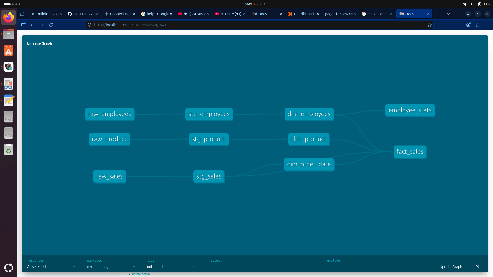

Welcome to your new dbt project!

### Using the starter project

Try running the following commands:
- dbt run
- dbt test

### Resources:
- Learn more about dbt [in the docs](https://docs.getdbt.com/docs/introduction)
- Check out [Discourse](https://discourse.getdbt.com/) for commonly asked questions and answers
- Join the [chat](https://community.getdbt.com/) on Slack for live discussions and support
- Find [dbt events](https://events.getdbt.com) near you
- Check out [the blog](https://blog.getdbt.com/) for the latest news on dbt's development and best practices
# Data-Modeling-Transformation-

------------------------------
## 📊 Custom Data Transformation Pipeline: [my_company]
Built with dbt, Postgres, and the Medallion Architecture
## 📖 Project Overview
This project demonstrates a production-grade analytics engineering workflow. I transformed raw, disparate CSV data into a structured, query-ready Dimensional Model (Star Schema) to enable business intelligence and reporting.
The primary goal was to apply Software Engineering best practices to data transformation, ensuring data quality, lineage, and modularity.
## 🏗️ Architecture: The Medallion Approach
I implemented a Medallion (Bronze/Silver/Gold) Architecture to ensure a clean data flow:

   1. Bronze (Raw Layer - Seeds): Raw data ingested via dbt seed. 
   2. Silver (Staging Layer):
   * Renamed columns for consistency (e.g., id to order_id).
      * Type casting (Strings to Dates/Decimals).
      * Initial data cleaning and deduplication.
   3. Gold (Marts Layer):
   * Dimension Tables (dim_): Descriptive data like products, dates, and customers.
      * Fact Tables (fact_): Quantitative transactional data (e.g., sales).
      * Logic: Integrated a conformed Date Dimension for cross-functional reporting.
   
## 🛠️ Key Technical Features

* Modular SQL: Heavily utilized CTEs (Common Table Expressions) for readability and to follow the "Import CTE" pattern.
* Data Validation: Implemented schema tests (Unique, Not Null, Relationship) to ensure integrity across the pipeline.
* Dry Principles: Used ref() and source() macros to manage dependencies and build a dynamic DAG (Directed Acyclic Graph).

## 🚀 How to Run

   1. Clone the repo:
   
   git clone [your-repo-link]
   
   2. Setup Environment:
   Ensure you have your profiles.yml configured in ~/.dbt/.
   3. Install Dependencies:
   
   dbt deps
   
   4. Build the Pipeline:
   
   dbt build  # Seeds, Runs, and Tests in one command
   
   
## 📈 Future Roadmap

* Cloud Integration: Migrate the warehouse from local Postgres to Databricks.
* ELT Automation: Replace CSV seeds with a live API ingestion script (Python).
* BI Visualization: Connect the Gold layer to Power BI for executive dashboards.

------------------------------

